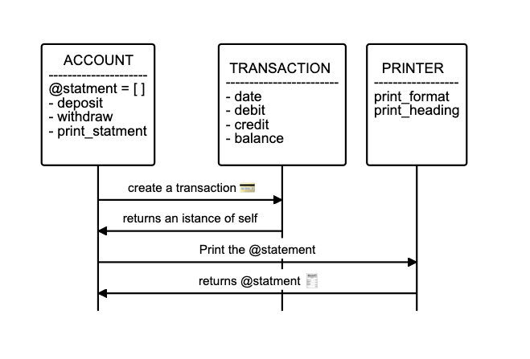
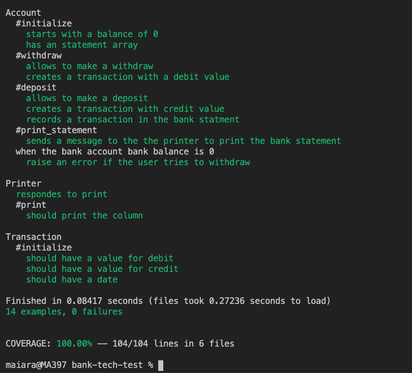

## Bank-tech-test

### Overview
Bank program that allows user to make transactions such as deposits, withdrawals and see and print the balance. 

### Specifications (given)
* You are able to interact with the code via IRB.
* Deposits, withdrawal.
* Account statement (date, amount, balance) printing.

### Acceptance criteria followed:

**Given** a client makes a deposit of 1000 on 10-01-2012  
**And** a deposit of 2000 on 13-01-2012  
**And** a withdrawal of 500 on 14-01-2012  
**When** she prints her bank statement  
**Then** she would see

```
date || credit || debit || balance
14/01/2012 || || 500.00 || 2500.00
13/01/2012 || 2000.00 || || 3000.00
10/01/2012 || 1000.00 || || 1000.00
```
## Approach

- I started by writing the user stories from the given specifications : 

**User Stories**

```
As a user
So I can use my money,
I would like to have bank account.

As a user
So I can move money into my account,
I want to be able to make a deposit.

As a user
So I can spend the money in my account, 
I want to be able to make a withdrawal.

As a user
So I can know how much money I have, 
I want to be able to see my balance.

As a user
So that I know my transaction history, 
I want to be able to see when each transaction was made.

As a user,
So that I can understand my transaction history,
I want to be able to see my transaction history in reverse chronological order.
```

- I then diagramed the classes and how they would pass the messages between them: 




- I followed a TDD and OOP approach.
- I followed the red, green refactored process, committing on green and then refactoring.
- Following SRP principles I divided the responsibility between three classes.

## Test Coverage




## Running the App on IRB:


## Technologies
* ruby ~2.7.0
* rspec
* gem 'simplecov' - checks the coverage of tests
* gem 'rubocop' - checks the code syntax


## Installation
* Clone the repo
* Run bundle install
* Run rspec to test


